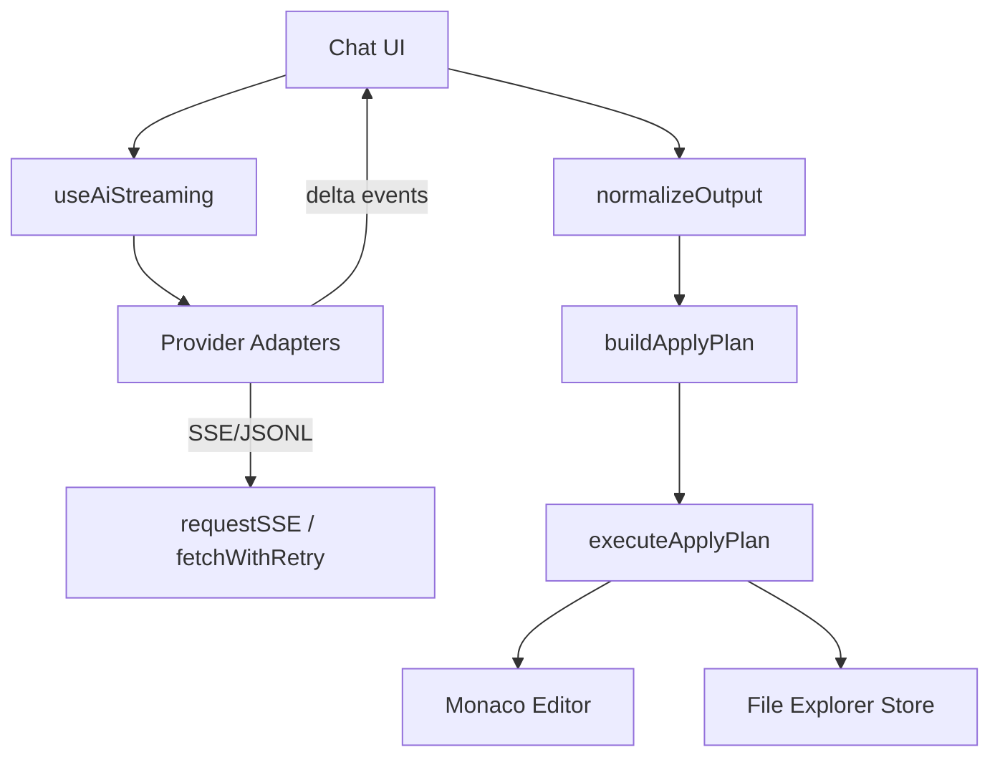

<!--
  Synapse IDE (coder-app) — Professional README
  This document is intentionally comprehensive for engineering audiences.
  Grounded in repository facts as of 2025-09-03.
-->

<h1 align="center">Synapse IDE — v.X.0.0 🚀🧠</h1>


<p align="center">
  <a href="https://react.dev" target="_blank"></a>
  <a href="https://vite.dev" target="_blank"></a>
  <a href="https://www.typescriptlang.org/" target="_blank"></a>
  <a href="https://microsoft.github.io/monaco-editor/" target="_blank"></a>
  <a href="https://vitest.dev" target="_blank"></a>
  <a href="https://playwright.dev" target="_blank"></a>
  <a href="https://eslint.org" target="_blank"></a>
  <a href="https://prettier.io" target="_blank"></a>
  <a href="#license"></a>
</p>

An in-browser IDE built with React + TypeScript and powered by Monaco. It includes a streaming AI assistant with provider adapters for OpenAI, Anthropic, Google Gemini, and local Ollama, plus an apply-plan pipeline that safely turns AI output into real file edits.

<details>
  <summary><strong>🏷️ Tags / Keywords</strong></summary>

- react, typescript, vite, monaco-editor, sse, jsonl, adapters, openai, anthropic, gemini, ollama
- streaming, apply-plan, normalize, redaction, telemetry, e2e, vitest, playwright, styled-components, radix-ui
- file explorer, tabs, editor bridge, vite proxy, devtools, tracing, flags, timeouts, resilience, fetch retry

</details>

---

## Contents

1. Overview and highlights
2. Quickstart (Windows/PowerShell friendly)
3. Providers, endpoints, streaming, and models
4. Architecture and data flow
5. Contracts (types and events)
6. Configuration (env vars, flags, storage)
7. Security, privacy, and telemetry
8. Operations runbook (debugging/tracing/health)
9. Performance characteristics and tuning
10. Accessibility status
11. Project layout
12. Testing and quality gates
13. Deployment options
14. Roadmap and scope notes
15. Contributing guidelines
16. License
17. Appendices (A–F)

---

## 1) Overview and highlights ✨


Synapse IDE is a client-first, browser-based IDE shell featuring:

- Monaco editor wrapper with themes and keyboard integration
- AI assistant with unified streaming across providers
- Apply-plan pipeline to transform AI output into safe file edits
- Local-first storage (settings, telemetry buffer) via localStorage
- Strong developer ergonomics: TypeScript types, lint/format, unit + e2e tests

Highlights

- React 19 + Vite 6 + TS 5; fast HMR and code-split bundles
- Streaming adapters for: OpenAI (SSE), Anthropic (SSE), Gemini (simulated streaming), Ollama (JSONL)
- Dev proxies for `/openai` and `/ollama` to avoid browser CORS during development
- Feature flags for tracing and E2E; centralized timeouts for predictable UX

---

## 2) Quickstart ⚡

https://github.com/user-attachments/assets/d76c82e9-12dc-4311-9804-97f539fb96d0

Prerequisites

- Node.js 18+ recommended

Install

```powershell
npm install
```

Run the dev server

```powershell
npm run dev
```

Build and preview

```powershell
npm run build
npm run preview
```

Type-check, lint, and tests

```powershell
npm run type-check
npm run lint
npm run test
npm run e2e
```

Useful scripts

- `dev:trace` — start with tracing flag (`/?trace=1`)
- `e2e:ci` — line reporter for CI
- `format` / `format:check` — Prettier
- `release:*` — version + changelog helpers
---
Note: Do not forget extract src.zip

## 3) Providers, endpoints, streaming, and models 🤖


Provider adapters: `src/services/ai/adapters/index.ts`

- OpenAI → endpoint: `openai_chat_completions` — transport: SSE
- Anthropic → endpoint: `anthropic_messages` — transport: SSE
- Google (Gemini) → endpoint: `gemini_generate` — transport: JSON; streaming simulated client-side
- Ollama (local) → endpoint: `ollama_generate` — transport: server JSONL streaming

Model registry: `src/utils/ai/models/registry.ts`

- OpenAI examples: `gpt-5`, `gpt-5-mini`, `gpt-5-nano`, `gpt-4o`, `gpt-4o-mini`, `chatgpt-4o-latest`, `gpt-4-turbo`, `gpt-4`, `gpt-3.5-turbo`
- Anthropic examples: `claude-4-{opus|sonnet|haiku}`, `claude-3.5-{sonnet|haiku|vision|opus}`, `claude-3-{opus|sonnet|haiku}`
- Google examples: `gemini-2.0-{pro-exp|flash-exp|flash-lite}`, `gemini-1.5-{pro(-latest)|flash|flash-8b}`, `gemini-pro`, `gemini-pro-vision`
- Ollama examples: `llama3.1` (and `:70b`), `llama3`, `llama2`, `codellama`, `mistral`, `mixtral`, `phi3`/`phi`, `deepseek-coder`, `qwen2.5-coder`, `starcoder2`

Notes

- Model metadata includes `supportsVision` and `supportsTools` flags; function/tool-calling is not wired in the current UI.
- The adapters normalize events to a common stream format: start → delta* → usage? → done | error.

---


## 🧬 Model Capability Matrix (auto-generated)

The table below is generated from `src/utils/ai/models/registry.ts`. To refresh it after changing the registry, run the script described later in this README.

<!-- BEGIN: MODEL_MATRIX -->
| Provider | Model | Vision | Tools | Cap Tokens | Endpoint |
|---|---|---:|---:|---:|---|
| openai | gpt-5 |  | ✓ | 200000 | openai_chat_completions |
| openai | gpt-5-mini |  | ✓ | 128000 | openai_chat_completions |
| openai | gpt-5-nano |  | ✓ | 64000 | openai_chat_completions |
| openai | gpt-4o | ✓ | ✓ | 128000 | openai_chat_completions |
| openai | gpt-4o-mini | ✓ | ✓ | 128000 | openai_chat_completions |
| openai | chatgpt-4o-latest | ✓ | ✓ | 128000 | openai_chat_completions |
| openai | gpt-4-turbo |  | ✓ | 128000 | openai_chat_completions |
| openai | gpt-4 |  | ✓ | 8192 | openai_chat_completions |
| openai | gpt-3.5-turbo |  |  | 4096 | openai_chat_completions |
| anthropic | claude-4-opus |  | ✓ | 200000 | anthropic_messages |
| anthropic | claude-4-sonnet |  | ✓ | 200000 | anthropic_messages |
| anthropic | claude-4-haiku |  |  | 200000 | anthropic_messages |
| anthropic | claude-3.5-opus-20241022 |  | ✓ | 200000 | anthropic_messages |
| anthropic | claude-3.5-vision-20241022 | ✓ | ✓ | 200000 | anthropic_messages |
| anthropic | claude-3-5-sonnet-20241022 |  | ✓ | 200000 | anthropic_messages |
| anthropic | claude-3-5-sonnet-20240620 |  | ✓ | 200000 | anthropic_messages |
| anthropic | claude-3-5-haiku-20241022 |  |  | 200000 | anthropic_messages |
| anthropic | claude-3-opus-20240229 |  |  | 200000 | anthropic_messages |
| anthropic | claude-3-sonnet-20240229 |  |  | 200000 | anthropic_messages |
| anthropic | claude-3-haiku-20240307 |  |  | 200000 | anthropic_messages |
| google | gemini-2.0-pro-exp |  | ✓ | 1000000 | gemini_generate |
| google | gemini-2.0-flash-lite |  |  | 1000000 | gemini_generate |
| google | gemini-2.0-flash-exp |  |  | 1000000 | gemini_generate |
| google | gemini-1.5-pro-latest |  | ✓ | 1000000 | gemini_generate |
| google | gemini-1.5-pro |  | ✓ | 1000000 | gemini_generate |
| google | gemini-1.5-flash |  |  | 1000000 | gemini_generate |
| google | gemini-1.5-flash-8b |  |  | 1000000 | gemini_generate |
| google | gemini-pro |  |  | 120000 | gemini_generate |
| google | gemini-pro-vision | ✓ |  | 120000 | gemini_generate |
| ollama | llama3.1 |  |  | 32768 | ollama_generate |
| ollama | llama3.1:70b |  |  | 32768 | ollama_generate |
| ollama | llama3 |  |  | 8192 | ollama_generate |
| ollama | llama2 |  |  | 8192 | ollama_generate |
| ollama | codellama |  |  | 8192 | ollama_generate |
| ollama | codellama:13b |  |  | 8192 | ollama_generate |
| ollama | mistral |  |  | 32768 | ollama_generate |
| ollama | mixtral |  |  | 32768 | ollama_generate |
| ollama | phi3 |  |  | 4096 | ollama_generate |
| ollama | phi |  |  | 4096 | ollama_generate |
| ollama | deepseek-coder |  |  | 16384 | ollama_generate |
| ollama | deepseek-coder:33b |  |  | 16384 | ollama_generate |
| ollama | qwen2.5-coder |  |  | 32768 | ollama_generate |
| ollama | starcoder2 |  |  | 16384 | ollama_generate |
<!-- END: MODEL_MATRIX -->

---

## 4) Architecture and data flow 🏗️

High-level graph



Key modules

- Streaming: `src/services/ai/http.ts` (SSE w/ open timeout), adapters at `src/services/ai/adapters/index.ts`
- Models & validation: `src/utils/ai/models/{registry,schema,validator}.ts`
- Output normalization: `src/utils/ai/lang/{languageMap,normalizeOutput}.ts`
- Apply plan: `src/utils/ai/apply/{buildApplyPlan,executeApplyPlan}.ts`
- IDE shell/editor: `src/components/ide/EnhancedIDE.tsx`, `src/components/editor/MonacoEditor.tsx`

Editor bridge capabilities (observed in IDE/editor components)

- Insert at cursor, replace active file, open tab, set active tab
- Integration points with apply-plan and command palette

---

## 5) Contracts (types and events) 📜

Streaming events (from `src/services/ai/adapters/types.ts`)

- `start` — adapter acknowledges request; provides `requestId`
- `delta` — token chunk with `text`
- `usage` — optional `{ prompt, completion }`
- `done` — end of stream (with optional `finishReason`)
- `error` — normalized `UnifiedError { code, provider?, status? }`

Adapter API (summary)

- `stream({ requestId, signal, baseUrl?, apiKey?, options, messages, onEvent, timeoutMs? })`
- `complete({ baseUrl?, apiKey?, options, messages, signal?, timeoutMs? })` returns `{ text, usage?, finishReason? }`

Apply plan types (from `buildApplyPlan.ts` / `executeApplyPlan.ts`)

- Inputs: `{ rawAssistantText, selectedLanguageId, mode, defaultDir?, existingPaths }`
- Output plan: `{ mode, items: [{ path, action: 'create'|'replace', code, monaco, ext, exists }], warnings }`
- Execution API: `{ createFile, replaceFile, insertIntoActive?, setActiveTab?, pushUndoSnapshot }`

Timeouts (from `src/config/timeouts.ts`)

- `sseOpenMs` (10s prod / 1s e2e), `idleMs`, `hardMs`, `retryBackoffMs`

Errors (from `src/services/ai/adapters/errors.ts`)

- `UnifiedErrorCode`: `network|timeout|rate_limit|auth|permission|content_blocked|invalid_request|server|cancelled|unknown`
- HTTP status mapping for `errorFromResponse` and `fromHttpError`

---

## 6) Configuration (env vars, flags, storage) ⚙️

Vite dev server (`vite.config.ts`)

- Port: 3000; opens browser automatically
- Proxy `/ollama` → `http://localhost:11434` (path rewritten)
- Proxy `/openai` → `https://api.openai.com` (path rewritten)

Environment variables (Vite)

- `VITE_AI_TELEMETRY_ENDPOINT` — dev telemetry endpoint (optional)
- `VITE_API_URL` — optional app API base; defaults handled in code
- `VITE_AI_TRACE` — `1` enables verbose adapter/HTTP tracing
- `VITE_E2E` — `1` enables e2e-moded timeouts and hooks
- `VITE_AUTORUN` — `1` auto-runs test harness in preview
- `VITE_OPENAI_API_KEY` — dev convenience for seeding key into settings

AI settings store (`src/stores/aiSettings.schema.ts`)

- Storage key: `synapse.ai.settings.v2`
- Defaults: `provider=openai`, `model=gpt-4o`, `stream=true`, `timeoutMs=30000`
- Presets: `BEGINNER_DEFAULT`, `PRO_DEFAULT`
- Merging semantics via `mergeAiSettingsV2`

Flags (`src/config/flags.ts`, usage across code)

- `aiTrace` — env/query/localStorage
- `e2e` — env/query/localStorage
- `a11yEnabled` — experimental

---

## 7) Security, privacy, and telemetry 🔒

Context safety (from `src/utils/ai/context/sanitize.ts` and `src/utils/safety/redactor.ts`)

- Redacts `.env`-style lines (`KEY=VALUE → KEY=[REDACTED]`)
- Masks emails, phone numbers, IPv4 addresses
- Strips nested code fences in context slices; normalizes whitespace; masks injection phrases

Telemetry (dev-only)

- Buffered to localStorage; endpoint configurable via `VITE_AI_TELEMETRY_ENDPOINT`
- No raw prompts or user code are sent by default (development convenience only)

---

## 8) Operations runbook (debugging / tracing / health) 🛠️

Fast checks

- OpenAI in dev: confirm `/openai` proxy is active; verify API key
- Ollama: ensure service on `http://localhost:11434`, model pulled; dev proxy `/ollama`
- Streaming doesn’t start: enable tracing and check `[SSE][OPEN]` and adapter `[ADAPTER_CHUNK]` logs

Enable tracing

```powershell
npm run dev:trace
# or add /?trace=1 to the URL
```

Inspecting usage and costs (where implemented)

- `useAiStreaming` sets usage via `setUsageAndMaybeCost()` when adapters emit `usage`

Common errors and mapping

- 401 → `auth`, 403 → `permission`, 404/409/422 → `invalid_request`, 408 → `timeout`, 429 → `rate_limit`, 5xx → `server`

Abort and late-token guards

- `useAiStreaming` ignores deltas after settle; buffers are flushed once on abort/error to avoid losing last chunks

---

## 9) Performance characteristics and tuning 🚀

Bundles

- Rollup manual chunks split `vendor` and `monaco` for better caching (`vite.config.ts`)

Streaming

- Buffered rendering via requestAnimationFrame to avoid per-token re-renders
- Open-timeout for SSE to fail fast; JSONL incremental parsing for Ollama
- Gemini simulates streaming from a single JSON response for consistent UX

Timeouts

- Tuned via `src/config/timeouts.ts`; e2e profile shortens them significantly

---

## 10) Accessibility status ♿

- Experimental `a11yEnabled` flag exists; not fully wired across all UI components
- Future work: focus management and keyboard-first command palette

---

## 11) Project layout (selected) 🗂️

- `src/components/ide/EnhancedIDE.tsx` — IDE shell and wiring
- `src/components/editor/MonacoEditor.tsx` — Monaco wrapper, themes, preview
- `src/services/ai/http.ts` — SSE client
- `src/services/ai/adapters/index.ts` — provider adapters (OpenAI/Anthropic/Gemini/Ollama)
- `src/utils/ai/models/*` — model registry, schema, validation
- `src/utils/ai/lang/*` — language map and output normalization
- `src/utils/ai/apply/*` — apply plan construction and execution
- `src/stores/**` — app/editor/file explorer/AI settings stores
- `e2e/**` — Playwright tests; `tests/**` — Vitest suites
- `github/src/**` — mirrored tree for deployment-oriented builds

---

## 12) Testing and quality gates ✅

Quality gates

- Type-check: `npm run type-check`
- Lint: `npm run lint`
- Unit tests: `npm run test`
- E2E tests: `npm run e2e`

CI reporter

- `npm run test:ci` writes JUnit to `junit.xml`

---

## 13) Deployment options 🚢

- Docker/Docker Compose present: `Dockerfile`, `docker-compose.yml`
- Fly.io: `fly.toml`; Render: `render.yaml`; Kubernetes: `k8s/`

---

## 14) Roadmap and scope notes 🗺️

- Tool/function-calling: models carry `supportsTools` but UI is not wired yet
- Provider health checks in UI (esp. Gemini/Ollama)
- Accessibility coverage and keyboard-first workflows
- Optional unified server proxy for providers

---

## 15) Contributing guidelines 🤝

- Keep public APIs stable; add/adjust tests if behavior changes
- Use ESLint/Prettier (`npm run lint`, `npm run lint:fix`)
- Follow module conventions for `utils/`, `stores/`, `services/`

---

## 16) License 📄

Private; no license specified in `package.json`. Add a license before public distribution.

---

## 17) Appendices 📚

<details>
  <summary><strong>🔌 Appendix A — Provider matrix (transport, endpoint, keys)</strong></summary>

Provider adapters: `src/services/ai/adapters/index.ts`

- OpenAI
  - Endpoint: `openai_chat_completions`
  - Transport: SSE
  - Dev proxy: `/openai` → `https://api.openai.com`
  - Key: `AiSettings.keys.openai` (seed via `VITE_OPENAI_API_KEY` in dev)

- Anthropic
  - Endpoint: `anthropic_messages`
  - Transport: SSE
  - Key: `AiSettings.keys.anthropic`

- Google (Gemini)
  - Endpoint: `gemini_generate`
  - Transport: JSON; streaming simulated from full response
  - Key: `AiSettings.keys.google`

- Ollama
  - Endpoint: `ollama_generate`
  - Transport: server JSONL stream
  - Base URL: `AiSettings.keys.ollama` (default `http://localhost:11434`)
  - Dev proxy: `/ollama` → local service

</details>

<details>
  <summary><strong>📑 Appendix B — Models (selected, from registry)</strong></summary>

See `src/utils/ai/models/registry.ts`. Examples include:

- OpenAI: `gpt-5`, `gpt-5-mini`, `gpt-5-nano`, `gpt-4o`, `gpt-4o-mini`, `chatgpt-4o-latest`, `gpt-4-turbo`, `gpt-4`, `gpt-3.5-turbo`
- Anthropic: `claude-4-{opus|sonnet|haiku}`, `claude-3.5-{sonnet|haiku|vision|opus}`, `claude-3-{opus|sonnet|haiku}`
- Google: `gemini-2.0-{pro-exp|flash-exp|flash-lite}`, `gemini-1.5-{pro(-latest)|flash|flash-8b}`, `gemini-pro`, `gemini-pro-vision`
- Ollama: `llama3.1`, `llama3.1:70b`, `llama3`, `llama2`, `codellama`, `mistral`, `mixtral`, `phi3`, `phi`, `deepseek-coder`, `qwen2.5-coder`, `starcoder2`

Each entry carries optional flags like `supportsVision`/`supportsTools`, and an `endpoint` (explicit or inferred by provider).

</details>

<details>
  <summary><strong>❗ Appendix C — Error codes and mapping</strong></summary>

From `src/services/ai/adapters/errors.ts` and `types.ts`:

- Codes: `network`, `timeout`, `rate_limit`, `auth`, `permission`, `content_blocked`, `invalid_request`, `server`, `cancelled`, `unknown`
- HTTP → code mapping (example): 401 → `auth`, 403 → `permission`, 404/409/422 → `invalid_request`, 408 → `timeout`, 429 → `rate_limit`, 5xx → `server`

All adapter errors are normalized to `UnifiedError { code, provider?, status?, raw? }`.

</details>

<details>
  <summary><strong>📶 Appendix D — Streaming hook behavior</strong></summary>

From `src/hooks/useAiStreaming.ts`:

- Single-flight per `groupKey` with abort of prior in-flight
- Buffered delta handling via rAF; guards against late tokens after settle
- Tracing spans: build_prompt, connect, stream; usage attribution when provided
- Central `timeouts.sseOpenMs` applied to adapters for snappy connects (esp. in E2E)

</details>

<details>
  <summary><strong>🧩 Appendix E — Apply plan pipeline</strong></summary>

From `src/utils/ai/apply/{buildApplyPlan,executeApplyPlan}.ts`:

- Normalize assistant output → infer files and monaco language IDs
- Beginner mode: replace-existing vs create-new selection
- Pro mode: collision-safe renaming (`file-2.ts`), then create
- Execution API supports `insertIntoActive` (when desired) and undo snapshots

</details>

<details>
  <summary><strong>🧪 Appendix F — Dev utilities and flags</strong></summary>

- Flags: `aiTrace`, `e2e`, `a11yEnabled` (experimental)
- SSE client traces: `[SSE][INIT|OPEN|DONE|RETRY|OPEN_TIMEOUT]`
- Adapter traces: `[ADAPTER_REQUEST|FIRST_CHUNK|STREAM_END|CHUNK]`
- HTTP retry/backoff behavior centralized in `requestSSE` and `fetchWithRetry`

</details>

---

### ⚙️ Appendix G — AI settings reference (types, defaults)

Source: `src/stores/aiSettings.schema.ts`

Interface `AiSettings`

- `mode`: `'beginner' | 'pro'`
- `provider`: `'openai' | 'anthropic' | 'google' | 'ollama'`
- `model`: `string` (model id)
- `languageId`: `string` (e.g., `'typescript'`)
- `temperature`: `number`
- `maxTokens`: `number`
- `stream`: `boolean`
- `timeoutMs`: `number`
- `safetyLevel?`: `'standard' | 'strict' | 'off'`
- `keys?`: `Partial<Record<ProviderKey, string>>`
- `activePresetId?`: `string`
- `usePresets?`: `boolean` (default false)
- `useWorkspaceContext?`: `boolean` (default false)

Defaults (`DEFAULT_AI_SETTINGS_V2`)

- `mode`: `beginner`
- `provider`: `openai`
- `model`: `gpt-4o`
- `languageId`: `typescript`
- `temperature`: `0.2`
- `maxTokens`: `2048`
- `stream`: `true`
- `timeoutMs`: `30000`
- `safetyLevel`: `standard`
- `keys`: `{ ollama: 'http://localhost:11434' }`
- `usePresets`: `false`
- `useWorkspaceContext`: `false`

Persistence (v2)

- Storage key: `synapse.ai.settings.v2`
- Helpers: `loadAiSettingsV2`, `saveAiSettingsV2`, `subscribeAiSettingsV2`, `mergeAiSettingsV2`

Presets

- `BEGINNER_DEFAULT` → `{ mode: 'beginner', temperature: 0.3, stream: true }`
- `PRO_DEFAULT` → `{ mode: 'pro', temperature: 0.2, stream: true }`

---

### 🤖 Appendix H — Provider adapter behaviors (summary/pseudocode)

OpenAI (SSE)

1. POST `/v1/chat/completions` with `{ model, messages, stream: true }`
2. Parse SSE lines; on `choices[0].delta.content` emit `delta`
3. On `[DONE]` or `finish_reason`, emit `done`
4. Usage tokens (if present) mapped to `{ prompt, completion }`

Anthropic (SSE)

1. POST `/v1/messages` with consolidated user message (system + user)
2. Parse SSE lines; extract `delta.text` or `content_block_delta.text`
3. Emit `delta`; on stream end or `[DONE]`, emit `done`

Gemini (JSON → simulated)

1. POST `models/{model}:generateContent`
2. Extract full text from `candidates[0].content.parts[0].text`
3. Split into ~60-char chunks and emit `delta` with small delays

Ollama (JSONL)

1. POST `/api/generate` with `{ model, prompt, stream: true }`
2. Read stream via `ReadableStream.getReader()`; decode line by line
3. Each JSON line’s `response` is a `delta`; when `json.done`, emit `done`

---

### 📡 Appendix I — HTTP/SSE client details

Source: `src/services/ai/http.ts`

- Supports JSON requests with retry/backoff and SSE with open-timeout
- Trace tags (dev): `[HTTP][INIT|ERROR_STATUS|RETRY|DONE|FAIL]`, `[SSE][INIT|ERROR_STATUS|RETRY|OPEN_TIMEOUT|OPEN|DONE]`
- `openTimeoutMs` aborts connections that don’t open in time

---

### 🛣️ Appendix J — Vite proxy rewrites

Source: `vite.config.ts`

- `/ollama` → `http://localhost:11434`; rewrite: `^/ollama` → `` (keeps `/api/*`)
- `/openai` → `https://api.openai.com`; rewrite: `^/openai` → `` (keeps `/v1/*`)

---

### 🧼 Appendix K — Context sanitization and redaction

Sources: `src/utils/ai/context/sanitize.ts`, `src/utils/safety/redactor.ts`

- Redact `.env`-style `KEY=VALUE` lines → `KEY=[REDACTED]`
- Mask PII: emails, phone numbers, IPv4 addresses
- Strip nested fence openers; normalize whitespace
- Mask likely injection phrases with neutral markers

---

### 🔧 Appendix L — Normalization and apply-plan

Sources: `src/utils/ai/lang/normalizeOutput.ts`, `src/utils/ai/lang/languageMap.ts`, `src/utils/ai/apply/*`

- Normalize AI output into `{ files: [{ path, code, monaco, ext }], warnings }`
- Beginner mode prefers replace-existing; Pro mode prefers create with collision-safe names
- Execute via editor API: `createFile`, `replaceFile`, optional `insertIntoActive`, `pushUndoSnapshot`

---

### 🚨 Appendix M — Error handling and user messages

Sources: `src/services/ai/adapters/errors.ts`, `types.ts`

- Normalized `UnifiedError` with `code`, optional `provider` and `status`
- Typical mappings: auth/permission/rate_limit/timeout/server/invalid_request

---

### ⚡ Appendix N — Performance guidance

- Use dev proxy for OpenAI/Ollama to avoid CORS and reduce latency
- Keep `aiTrace` off in production-like runs to minimize console overhead
- Prefer Pro mode for multi-file code generation to avoid destructive replaces

---

### 🧪 Appendix O — E2E and unit testing notes

Files: `playwright.config.ts`, `e2e/chat.spec.ts` and `tests/*`

- E2E focuses on chat/streaming flows; `VITE_E2E=1` shortens timeouts
- Unit tests target normalization, guards, and stores

---

### 🏷️ Appendix P — Release and versioning

Scripts from `package.json`

- `release:version` — bump package version
- `release:changelog` — generate changelog
- `release` — run bump + changelog + build

---

### 📘 Appendix Q — Glossary

- SSE — Server-Sent Events (one-way streaming from server)
- JSONL — JSON Lines (newline-delimited JSON objects)
- rAF — requestAnimationFrame (browser frame callback)
- E2E — End-to-End tests (Playwright)
- HMR — Hot Module Replacement (dev server live updates)

---

### 🏷️ Appendix R — Tags / Keywords (extended)

- ide, in-browser, monaco, react, typescript, vite, zustand, styled-components, radix-ui, lucide-react
- sse, jsonl, fetch, retry, adapters, provider, endpoint, gemini, anthropic, openai, ollama
- streaming, apply-plan, normalization, redaction, telemetry, tracing, e2e, vitest, playwright
- file-explorer, tabs, editor-bridge, vite-proxy, timeouts, resilience, safety, sanitize, usage

---

### 📜 Appendix S — Scripts reference (from package.json)

Core

- `start` → `vite`
- `dev` → `vite`
- `dev:trace` → `vite --open '/?trace=1'`
- `dev:safe` → `vite --host 0.0.0.0 --port 3000`
- `dev:cmd` → `vite`

Build & type-check

- `build` → `tsc -b && vite build`
- `typecheck` → `tsc -p tsconfig.json --noEmit`
- `type-check` → `tsc --noEmit`

Testing

- `test` → `vitest run`
- `test:ci` → `vitest run --reporter=junit --outputFile=junit.xml`
- `e2e` → `playwright test`
- `e2e:ci` → `playwright test --reporter=line`

Linting & formatting

- `lint` → `eslint . --ext ts,tsx --report-unused-disable-directives`
- `lint:fix` → `eslint . --ext ts,tsx --fix`
- `format` → `prettier --write "src/**/*.{ts,tsx,js,jsx,json,css,md}"`
- `format:check` → `prettier --check "src/**/*.{ts,tsx,js,jsx,json,css,md}"`

Preview & eval

- `test:dev` → `vite --open http://localhost:5173?tests=1&autorun=1`
- `test:preview` → `vite preview --open http://localhost:4173?tests=1&autorun=1`
- `preview` → `vite preview`
- `clean` → `rimraf dist`
- `build:eval` → `tsc -p tsconfig.eval.json`
- `eval` / `eval:record` / `eval:ci` → run evaluation scripts under `scripts/eval`

Releases

- `release:changelog`, `release:version`, `release:tag`, `release`

---

### 🗺️ Appendix T — Vite aliases (from vite.config.ts)

- `@` → `./src`
- `@/components` → `./src/components`
- `@/hooks` → `./src/hooks`
- `@/utils` → `./src/utils`
- `@/types` → `./src/types`
- `@/styles` → `./src/styles`
- `@/contexts` → `./src/contexts`
- `@/pages` → `./src/pages`
- `@/assets` → `./src/assets`

---

### 📁 Appendix U — Directory map (selected)

Top-level

- `src/` — application source
- `public/` — static assets
- `tests/` — Vitest suites
- `e2e/` — Playwright specs and utilities
- `k8s/` — deployment manifest
- `scripts/` — CI, eval, release scripts
- `github/` — mirrored build with `src/` subtree

Testing artifacts

- `playwright-report/`, `test-results/`, `junit.xml`

---

### 🧰 Appendix V — E2E support utilities

- `e2e/utils/sse.ts` — helpers for SSE in E2E contexts
- `e2e/chat.spec.ts` — streaming chat spec

---

### 🛠️ Appendix W — Tooling configs

- `eslint.config.js` — ESLint configuration
- `vitest.config.{ts|mjs}` — Vitest configuration
- `playwright.config.ts` — Playwright configuration
- `postcss.config.js` — PostCSS, used with Tailwind configuration present
- `tsconfig*.json` — TypeScript project configs (app, node, eval)

---

### 📦 Appendix X — Build outputs and chunking

- `build.outDir` → `dist`
- `sourcemap: true` for production builds
- `chunkSizeWarningLimit: 1200`
- `rollupOptions.output.manualChunks` → `{ vendor: [...], monaco: [...] }`

---

### 🌐 Appendix Y — Known ports and endpoints

- Dev server: `http://localhost:3000`
- OpenAI proxy: `/openai` (rewritten to `https://api.openai.com`)
- Ollama proxy: `/ollama` (rewritten to `http://localhost:11434`)

---

### 🎨 Appendix Z — Style and UI

- `styled-components` for theming and component styles
- `@radix-ui/react-*` for primitives (dialog, dropdown, tabs, toast)
- `lucide-react` for icons
- `framer-motion` for motion primitives


